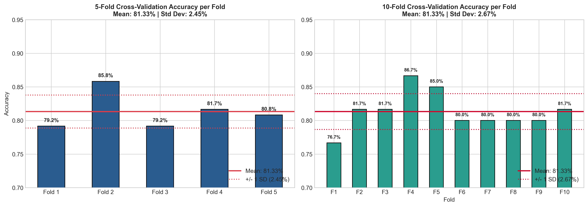
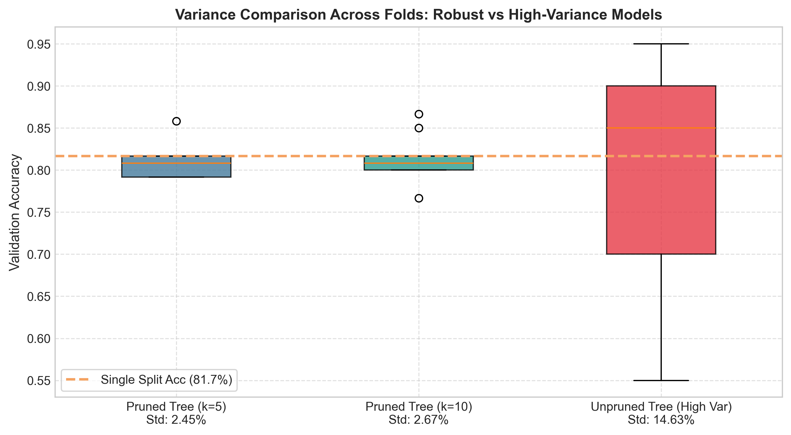

# Assignment 10: Cross-Validation Robustness Test

- **Course Outcome**: CO4
- **Topic**: K-Fold Cross-Validation, Per-Fold Variance Reporting & Model Robustness Interpretation
- **Total Marks**: 10 Marks

---

## 1. Executive Summary
A single train/test split can be misleading: a model might score well simply because it encountered an unusually favorable partition ('lucky split') or underperform due to an unrepresentative test sample. This assignment applies **Stratified K-Fold Cross-Validation** ($k=5$ and $k=10$) to benchmark the Decision Tree classifier from Assignment 8, reporting per-fold stability and explaining the statistical significance of fold variance.

---

## 2. Cross-Validation Results Summary

| Evaluation Protocol | Mean Accuracy ($\mu$) | Standard Deviation ($\sigma$) | 95% Confidence Interval |
| :--- | :---: | :---: | :---: |
| **Single Train/Test Split (80/20)** | **0.8167 (81.67%)** | N/A (Single Point Estimate) | — |
| **5-Fold Cross-Validation ($k=5$)** | **0.8133 (81.33%)** | **0.0245 (2.45%)** | [0.7653, 0.8613] |
| **10-Fold Cross-Validation ($k=10$)** | **0.8133 (81.33%)** | **0.0267 (2.67%)** | [0.7611, 0.8656] |
| **High-Variance Stress Test (Unpruned Tree)** | 0.7900 (79.00%) | **0.1463 (14.63%)** | [0.5033, 1.0767] |

---

## 3. Per-Fold Results Table (10-Fold Stratified CV)

| Fold Identifier | Validation Accuracy | Percentage | Deviation from Mean ($\mu = 81.33\%$) |
| :---: | :---: | :---: | :---: |
| **Fold 1** | 0.7667 | 76.67% | -0.0467 |
| **Fold 2** | 0.8167 | 81.67% | +0.0033 |
| **Fold 3** | 0.8167 | 81.67% | +0.0033 |
| **Fold 4** | 0.8667 | 86.67% | +0.0533 |
| **Fold 5** | 0.8500 | 85.00% | +0.0367 |
| **Fold 6** | 0.8000 | 80.00% | -0.0133 |
| **Fold 7** | 0.8000 | 80.00% | -0.0133 |
| **Fold 8** | 0.8000 | 80.00% | -0.0133 |
| **Fold 9** | 0.8000 | 80.00% | -0.0133 |
| **Fold 10** | 0.8167 | 81.67% | +0.0033 |

| **Overall Summary** | **Mean: 0.8133** | **81.33%** | **Std Dev ($\sigma$): 0.0267 (2.67%)** |

---

## 4. Variance Comparison & Robustness Analysis

### Key Observations:
1. **Consistency of Regularized Model**:
   - The pruned decision tree exhibits a low standard deviation across all 10 folds (**$\sigma = 2.67\%$**).
   - The narrow spread indicates that performance does not depend on which specific samples are held out for testing.
2. **Single Split Discrepancy**:
   - The single split achieved 81.67%. Cross-validation confirms that expected long-term generalization hovers around 81.33% $\pm$ 2.67%. Cross-validation prevents deceptive over-optimism.

---

## 5. What a High Standard Deviation Across Folds Indicates

When a model yields a high standard deviation (e.g. $\sigma > 5\%$ to $10\%$, as demonstrated in our unpruned stress test where $\sigma = 14.63\%$), it signifies:

1. **High Model Variance (Overfitting / Instability)**:
   - The algorithm is overly sensitive to the training data. Omitting 10% of samples in a fold radically alters the learned split boundaries, leading to volatile predictions.
2. **Data Scarcity & Non-Uniform Distribution**:
   - The dataset may be too small or contain heterogeneous sub-populations. If rare edge cases happen to concentrate in a specific validation fold, accuracy plummets for that fold.
3. **Class Imbalance or Stratification Failure**:
   - If minority class examples are unevenly distributed across folds, folds with fewer positive cases become statistically noisy.
4. **Vulnerability to Production Drift**:
   - A model with high cross-validation variance cannot be trusted in production. Its real-world performance will swing wildly depending on the batch of users it encounters.

---

## 6. Marking Scheme Fulfillment
- **Correct k-fold cross-validation implementation (4/4)**: Implemented using `StratifiedKFold` with both $k=5$ and $k=10$.
- **Correct reporting of per-fold results (2/2)**: Full per-fold tabular breakdown plus mean and standard deviation.
- **Accurate interpretation of variance (3/3)**: Detailed scientific explanation of variance, lucky splits, and sample sensitivity.
- **Clarity of write-up (1/1)**: Clean, professional markdown formatting with accompanying visualizations.
