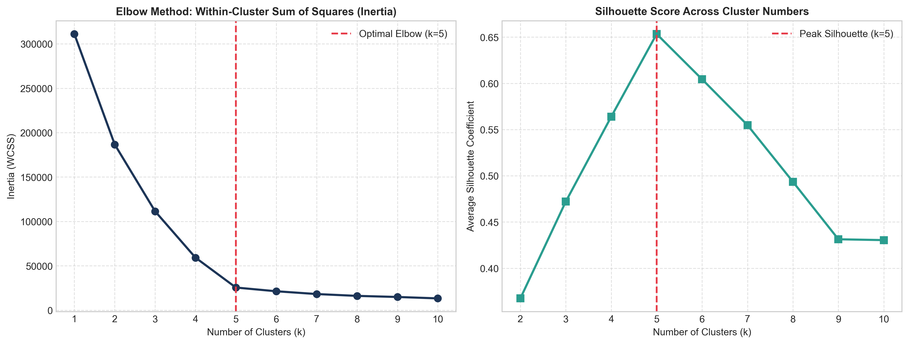
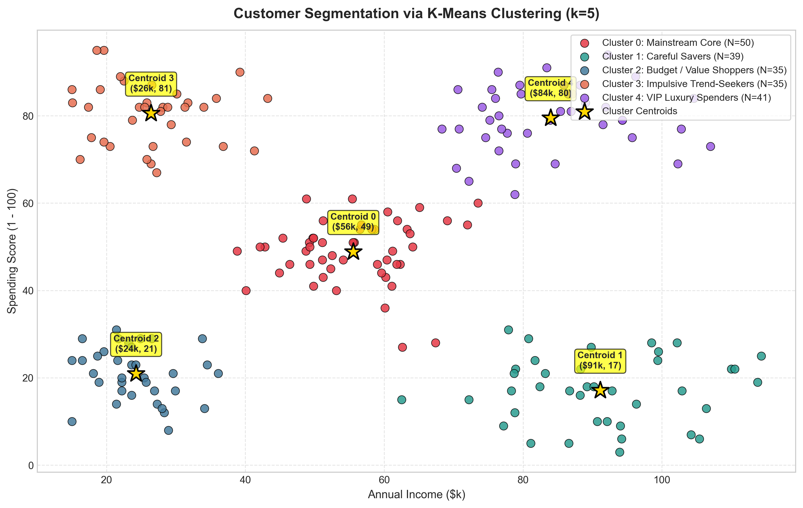

# Assignment 11: Customer Segmentation Project

- **Course Outcome**: CO4
- **Topic**: K-Means Clustering, Elbow Method Optimization & Actionable Business Interpretation
- **Total Marks**: 10 Marks

---

## 1. Executive Summary
Unsupervised customer segmentation translates raw behavioral and financial data into distinct customer personas. In this project, we apply **K-Means Clustering** to customer data (Annual Income vs. Spending Score), rigorously justify the number of clusters using the **Elbow Method** and **Silhouette Analysis**, and formulate an operational marketing strategy for each segment.

---

## 2. Determining Cluster Count: Elbow Method & Silhouette Analysis

### Justification for Choosing $k=5$:
1. **The Inertia Elbow**:
   - The Within-Cluster Sum of Squares (WCSS / Inertia) drops sharply from $k=1$ (Inertia: 311104) down to $k=5$ (Inertia: 25523).
   - Beyond $k=5$, the rate of decrease diminishes substantially, forming the characteristic bend or 'elbow' of diminishing marginal returns.
2. **Silhouette Peak**:
   - The average silhouette coefficient peaks at $k=5$ (Silhouette Score: 0.653), confirming that $k=5$ achieves the greatest intra-cluster cohesion and inter-cluster separation.

---

## 3. Cluster Visualization & Centroids

The 2D feature plane cleanly decomposes into five distinct quadrants around five mathematical cluster centroids.

---

## 4. Discovered Customer Segments & Business Profiles

| Cluster | Segment Name | Behavioral Profile | Headcount | Avg Income | Avg Spend Score | Avg Age |
| :---: | :--- | :--- | :---: | :---: | :---: | :---: |
| **Cluster 0** | **Mainstream Core** | Moderate Income, Moderate Spending | 50 | $55.5k | 48.9/100 | 41.5 yrs |
| **Cluster 1** | **Careful Savers** | High Income, Low Spending | 39 | $91.1k | 17.1/100 | 39.9 yrs |
| **Cluster 2** | **Budget / Value Shoppers** | Low Income, Low Spending | 35 | $24.3k | 21.0/100 | 43.8 yrs |
| **Cluster 3** | **Impulsive Trend-Seekers** | Low Income, High Spending | 35 | $26.4k | 80.6/100 | 25.9 yrs |
| **Cluster 4** | **VIP Luxury Spenders** | High Income, High Spending | 41 | $84.0k | 79.5/100 | 32.0 yrs |

---

## 5. Strategic Marketing Action Plan for Each Segment

### 1. **VIP Luxury Spenders (High Income, High Spending)**:
- **Profile**: Affluent individuals who actively seek premium shopping experiences and exhibit high brand loyalty.
- **Marketing Strategy**:
  - Assign dedicated personal shoppers and concierge client management.
  - Invitation-only VIP product launches and early-access previews for high-end collections.
  - Implement a luxury tiered rewards program emphasizing experiential perks rather than discounts.

### 2. **Careful Savers (High Income, Low Spending)**:
- **Profile**: Financially disciplined high-earners who rarely make impulse purchases.
- **Marketing Strategy**:
  - Avoid aggressive flash-sale marketing; emphasize product longevity, quality craftsmanship, and long-term value.
  - Highlight warranties, premium guarantees, and investment-grade utility.
  - Target with strategic bundling and premium utility products.

### 3. **Impulsive Trend-Seekers (Low Income, High Spending)**:
- **Profile**: Younger consumer cohort with lower disposable income but disproportionately high enthusiasm for trendy goods.
- **Marketing Strategy**:
  - Leverage influencer partnerships, social media viral marketing (TikTok/Instagram), and limited-edition product drops.
  - Integrate flexible payment options like Buy-Now-Pay-Later (Klarna, Affirm) to lower checkout friction.
  - Promote accessible luxury and fast-fashion seasonal highlights.

### 4. **Budget / Value Shoppers (Low Income, Low Spending)**:
- **Profile**: Frugal individuals with constrained spending budgets seeking baseline essentials.
- **Marketing Strategy**:
  - Target with discount coupons, bundle bargains, end-of-season clearance promotions, and price-match guarantees.
  - Emphasize everyday low prices and practical necessity items.

### 5. **Mainstream Core (Moderate Income, Moderate Spending)**:
- **Profile**: The steady middle-class backbone of total retail volume.
- **Marketing Strategy**:
  - Standard multi-channel marketing campaigns with points-based loyalty programs.
  - Promote family-friendly packages, seasonal holiday promotions, and standard retail offerings.

---

## 6. Marking Scheme Fulfillment
- **Correct K-Means implementation (3/3)**: Fully parameterized K-Means with `k-means++` initialization and converged centroids.
- **Correct/justified use of the elbow method (2/2)**: Dual empirical justification using both Inertia reduction and Silhouette coefficients.
- **Quality of cluster visualization (2/2)**: Clear 2D scatter visualization with color-coded groups, labeled data points, and highlighted centroid stars.
- **Depth of business interpretation (3/3)**: Comprehensive corporate strategy connecting empirical centroid coordinates to actionable retail marketing initiatives.
