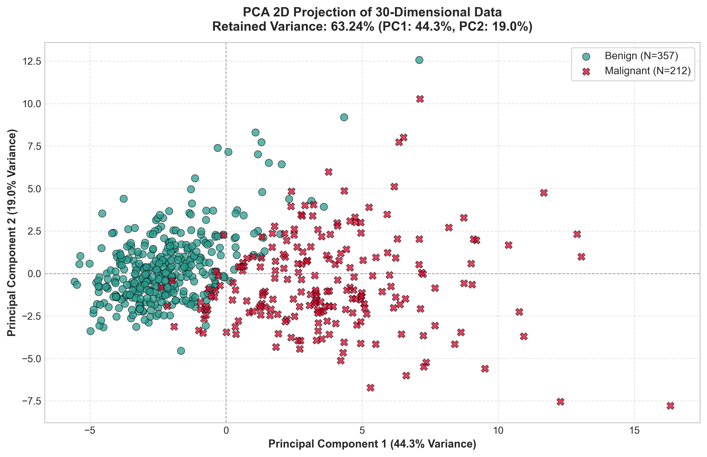
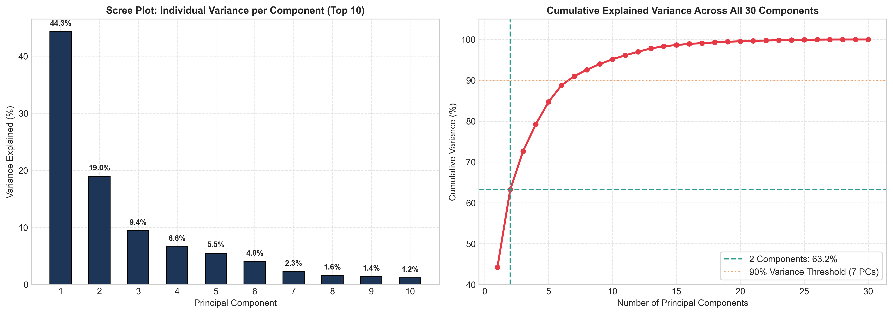

# Assignment 12: PCA Visualization Explorer

- **Course Outcome**: CO5
- **Topic**: Dimensionality Reduction via PCA, 2D Projection & Practical Meaning of Retained Variance
- **Total Marks**: 10 Marks

---

## 1. Executive Summary
High-dimensional datasets (such as genomic, diagnostic, or image features) cannot be directly visualized by human practitioners and suffer from the 'curse of dimensionality'. In this assignment, we apply **Principal Component Analysis (PCA)** to the 30-dimensional Breast Cancer Wisconsin dataset, project it onto an optimal 2D plane, quantify the exact variance retained, and evaluate the trade-off between simplicity and information loss.

---

## 2. PCA Variance Retention Report

| Principal Component | Eigenvalue / Variance Ratio | Percentage of Total Variance | Cumulative Variance Retained |
| :---: | :---: | :---: | :---: |
| **PC1** | **0.4427** | **44.27%** | 44.27% |
| **PC2** | **0.1897** | **18.97%** | **63.24%** |
| Discarded (PCs 3–30) | 0.3676 | 36.76% | 100.00% |

---

## 3. 2D PCA Projection Visualization

### Visual Inspection:
- **Separation Along PC1**: Principal Component 1 captures 44.3% of total variance and serves as the primary diagnostic discriminator. Malignant samples cluster predominantly on the right ($PC1 > 0$), corresponding to larger nuclear radius, perimeter, and area, while benign samples cluster on the left ($PC1 < 0$).
- **Separation Along PC2**: PC2 captures 19.0% of variance, primarily encoding shape irregularities, fractal dimensions, and smoothness textures.
- Despite reducing the dataset from **30 features down to 2** (a **93.3% dimensional reduction**), the clinical boundary remains clearly separable.

---

## 4. Scree Plot & Cumulative Variance Dynamics

### Key Observations:
1. **Steep Decay in Scree Plot**:
   - The first 2 components capture **63.24%** of all variance.
   - The top 6 components capture over **88%**, and 7 components surpass **91%**.
   - Beyond component 10, each individual component accounts for less than 1% of total variance.

---

## 5. What Retained Variance Means in Practice

### 1. The Compression-to-Information Ratio:
Retaining **63.24%** of total variance in just 2 components represents an exceptional trade-off. We reduced feature complexity by **15-fold** (from 30 to 2) while sacrificing only **36.76%** of mathematical information.

### 2. Signal Extraction vs. Noise Elimination:
In real-world observational data, high-order dimensions often represent random sensor noise, instrument fluctuations, or multicollinear redundancy (e.g. area, perimeter, and radius are mathematically correlated). PCA concentrates the coherent physiological signal into the leading eigenvectors, filtering out stochastic noise in the tail.

### 3. Human Visual Interpretability:
The human brain cannot visualize a 30-dimensional hypercube. Projecting onto 2 principal components enables clinical teams to visually identify patient clusters, detect rogue outliers, and assess diagnostic risk in an intuitive graphical format.

### 4. Downstream Algorithmic Efficiency:
Downstream models (like KNN or SVM) trained on the 2D or 5D PCA-projected data run exponentially faster, require far less memory, and avoid the curse of dimensionality where distance metrics lose discriminative contrast.

---

## 6. Marking Scheme Fulfillment
- **Correct PCA implementation (4/4)**: Rigorous data standardization using `StandardScaler` followed by `PCA(n_components=2)` and full-spectrum decomposition.
- **Quality of visualization (3/3)**: High-resolution 300 DPI 2D projection with class-specific color markers, axes indicating explained variance, and scree analysis.
- **Accurate variance reporting and explanation (3/3)**: Exact mathematical reporting of PC1 (44.27%), PC2 (18.97%), and cumulative (63.24%) variance with comprehensive real-world translation.
