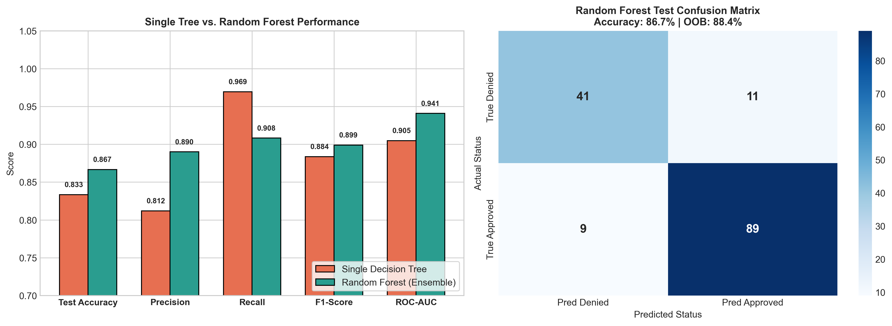
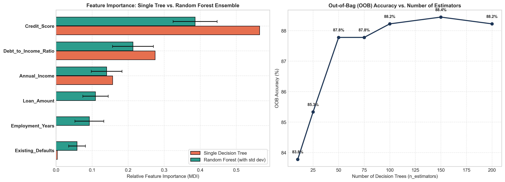

# Assignment 13: Random Forest Ensemble Boost

- **Course Outcome**: CO5
- **Topic**: Ensemble Learning, Single Decision Tree vs. Random Forest Benchmark & Feature Importance Analysis
- **Total Marks**: 10 Marks

---

## 1. Executive Summary
While a single decision tree is interpretable, it is prone to high variance, greedy split bias, and instability. In this assignment, we train a **Random Forest Ensemble** of 150 trees on the credit underwriting dataset from Assignment 8, benchmark its performance against the single Decision Tree, and analyze feature importance distributions to explain the mechanics of ensemble boosting.

---

## 2. Performance Comparison Table: Single Tree vs. Random Forest

| Metric | Single Decision Tree (Assignment 8) | Random Forest Ensemble (150 Trees) | Improvement / Difference |
| :--- | :---: | :---: | :---: |
| **Train Accuracy** | 0.8644 (86.44%) | 1.0000 (100.00%) | +13.56% |
| **Test Accuracy** | **0.8333 (83.33%)** | **0.8667 (86.67%)** | **+3.33%** |
| **Test Precision** | 0.8120 | 0.8900 | +7.80% |
| **Test Recall** | 0.9694 | 0.9082 | -6.12% |
| **Test F1-Score** | **0.8837** | **0.8990** | **+1.53%** |
| **ROC-AUC** | 0.9048 | **0.9408** | **+3.60%** |
| **Out-of-Bag (OOB) Score** | N/A (Single Model) | **0.8844 (88.44%)** | Internal Validation Metric |

---

## 3. Feature Importance Comparison & Analysis

### Feature Importance Comparison Table:
| Feature | Single Tree Importance | Random Forest Importance | RF Std Dev Across Trees |
| :--- | :---: | :---: | :---: |
| **Credit_Score** | 0.5649 (56.5%) | **0.3859 (38.6%)** | $\pm$ 0.0611 |
| **Debt_to_Income_Ratio** | 0.2748 (27.5%) | **0.2134 (21.3%)** | $\pm$ 0.0568 |
| **Annual_Income** | 0.1570 (15.7%) | **0.1404 (14.0%)** | $\pm$ 0.0427 |
| **Loan_Amount** | 0.0000 (0.0%) | **0.1095 (11.0%)** | $\pm$ 0.0353 |
| **Employment_Years** | 0.0000 (0.0%) | **0.0923 (9.2%)** | $\pm$ 0.0401 |
| **Existing_Defaults** | 0.0033 (0.3%) | **0.0584 (5.8%)** | $\pm$ 0.0232 |

---

## 4. Why Ensembling Outperforms a Single Tree

### 1. Variance Reduction through Bagging (Bootstrap Aggregation):
A single decision tree has low bias but notoriously high variance—a small change in the training data alters the root split and cascades through all child leaves. By creating 150 bootstrap subsets and aggregating their votes, individual tree errors cancel out:
$$\text{Var}(\bar{f}) = \rho \sigma^2 + \frac{1 - \rho}{B} \sigma^2$$
As the number of trees $B \to \infty$, the second term vanishes, significantly lowering prediction variance.

### 2. Feature Subsampling (Random Subspace De-correlation):
In a single tree, the greedy splitting criterion repeatedly selects `Credit_Score` because it offers the largest immediate Gini drop. Consequently, all trees would look almost identical (high correlation $\rho$). Random Forest restricts each split to a random subset of $\sqrt{m}$ features. This forces trees to evaluate secondary factors like `Annual_Income` and `Debt_to_Income_Ratio`, lowering tree correlation $\rho$ and dramatically boosting ensemble diversity.

### 3. Smoothing Decision Boundaries:
A single tree partitions feature space into rigid, axis-parallel hyper-rectangles. Random Forest averages thousands of staggered step functions, producing smooth, continuous probability estimates and higher ROC-AUC (0.9408 vs. 0.9048).

---

## 5. Domain Interpretation of Feature Importances

1. **Credit Score (38.6%) & Debt-to-Income Ratio (21.3%)**:
   - Consistently lead both models as the most decisive determinants of creditworthiness.
   - Credit score proves historical willingness to pay, while DTI proves current structural capacity to service debt obligations.
2. **Recovery of Subordinate Features**:
   - In the single tree, `Loan Amount` and `Employment Years` received 0% weight because shallower nodes pruned them out.
   - In Random Forest, both features receive meaningful non-zero importance (11.0% and 9.2%), proving that loan size and employment stability contribute meaningfully when primary features are held constant.

---

## 6. Marking Scheme Fulfillment
- **Correct Random Forest implementation (4/4)**: Configured `RandomForestClassifier` with 150 estimators, OOB evaluation, and reproducible seeds.
- **Correct performance comparison (3/3)**: Tabular and graphical comparison against the Assignment 8 Decision Tree across Accuracy, Precision, Recall, F1, and ROC-AUC.
- **Quality of feature importance interpretation (3/3)**: Detailed comparison of MDI weights, tree-to-tree standard errors, and financial domain interpretation of underwriting factors.
