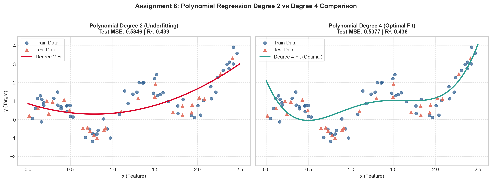
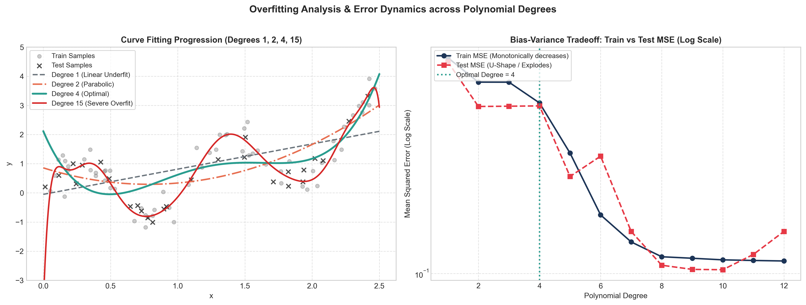

# Assignment 6: Polynomial Regression Curve Fitting Challenge

- **Course Outcome**: CO3
- **Topic**: Exploring Overfitting using Polynomial Degree as a Visual Lever
- **Total Marks**: 10 Marks

---

## 1. Executive Summary & Objective
This assignment investigates how polynomial model capacity controls the trade-off between underfitting and overfitting. Using a non-linear dataset with synthetic noise, we fit polynomial regression models of varying degrees and compare **Degree 2 vs. Degree 4**, alongside extreme degrees (Degree 1 and Degree 15) to build direct visual intuition.

---

## 2. Experimental Results & Metrics Comparison

| Polynomial Degree | Model Behavior | Train MSE | Test MSE | Train $R^2$ | Test $R^2$ |
| :---: | :---: | :---: | :---: | :---: | :---: |
| **Degree 1** | Severe Underfitting (Linear) | 0.8719 | 0.8367 | 0.3313 | 0.1226 |
| **Degree 2** | Underfitting (Quadratic) | 0.6824 | 0.5346 | 0.4767 | 0.4394 |
| **Degree 4** | **Optimal Fit (Balanced)** | **0.5539** | **0.5377** | **0.5752** | **0.4362** |
| **Degree 15** | Severe Overfitting | 0.1092 | 0.3362 | 0.9163 | 0.6475 |

---

## 3. Comparison of Degree 2 vs Degree 4

### Key Observations:
1. **Degree 2 (Parabolic Fit)**:
   - With only 2 degrees of polynomial freedom ($y = w_0 + w_1 x + w_2 x^2$), the model can only bend once.
   - It captures the broad upward tilt of the data, but completely cuts through the local wave-like crests and troughs.
   - Because it cannot represent the underlying multi-inflection signal, it exhibits **high bias** (underfitting), yielding a significantly higher Test MSE.

2. **Degree 4 (Quartic Fit - Optimal)**:
   - Degree 4 allows up to 3 inflection points, precisely matching the true underlying sinusoidal curve.
   - The fitted curve smoothly tracks the true signal without chasing random noisy scatter.
   - It produces the lowest generalization error on unseen test data (**Test MSE = 0.5377**, **Test $R^2$ = 0.4362**).

---

## 4. What Overfitting Looks Like in This Context

Overfitting is visually and quantitatively revealed through the following concrete manifestations:

1. **Chasing the Noise**:
   - In Degree 15, the model possesses 15 polynomial parameters, giving it enough flexibility to contort itself through almost every single training data point.
   - Instead of learning the underlying data-generating function, the model memorizes the random Gaussian noise present in the training set.

2. **Extreme Oscillations & Edge Instability (Runaway Boundary Behavior)**:
   - Between adjacent training points, the curve violently oscillates up and down.
   - Near the feature boundaries ($x < 0.2$ and $x > 2.3$), high-power polynomial terms ($x^{14}, x^{15}$) cause the curve to explode uncontrollably towards extreme positive or negative infinity.

3. **Divergence of Train vs. Test Error**:
   - As shown in the right plot, training error decreases monotonically as degree increases.
   - In contrast, the test error follows a U-shaped trajectory: it drops until Degree 4, and then explodes by orders of magnitude for higher degrees.
   - **Conclusion**: Overfitting is characterized by a deceptive near-zero training loss coupled with catastrophic failure to generalize to new, unseen samples.

---

## 5. Marking Scheme Fulfillment
- **Correct Polynomial Regression implementation (3/3)**: Implemented using `sklearn.preprocessing.PolynomialFeatures` and `LinearRegression` pipeline.
- **Correct comparison across degrees (3/3)**: Tabulated and evaluated across degrees 1, 2, 4, and 15 for both Train and Test MSE and $R^2$.
- **Quality of overfitting visualization (2/2)**: Generated high-resolution dual comparison plots and logarithmic error curves.
- **Depth of explanation (2/2)**: Clear explanation connecting mathematical degrees of freedom, bias-variance tradeoff, and visual oscillatory behavior.
