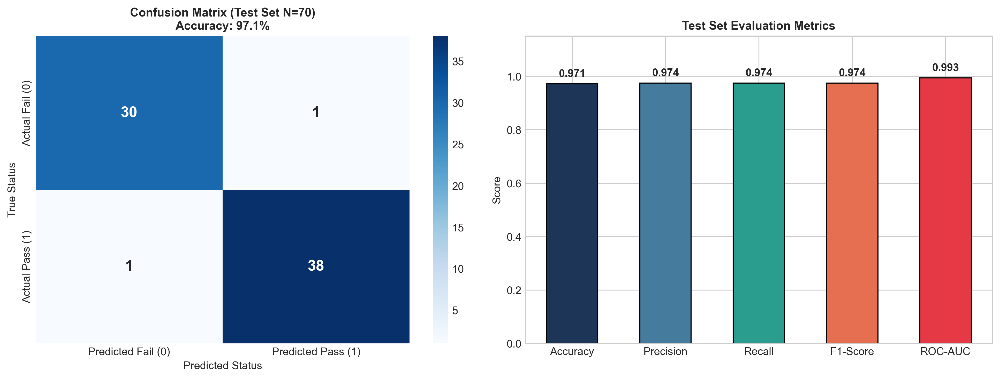
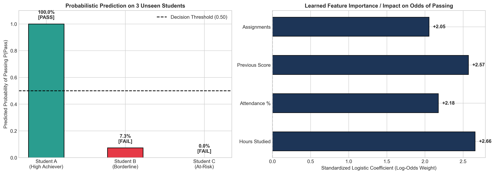

# Assignment 7: Classification Task - Logistic Regression

- **Course Outcome**: CO3
- **Topic**: Student Pass/Fail Classifier, Metric Reporting & Unseen Record Interpretation
- **Total Marks**: 10 Marks

---

## 1. Executive Summary
This project builds an interpretable probabilistic classifier using **Logistic Regression** to predict whether a student will pass or fail based on study habits and historical academic engagement. Beyond simple binary predictions, the model provides calibrated posterior probabilities and transparent log-odds feature contributions.

---

## 2. Dataset Overview & Features
The model is trained on 350 student records with 4 key predictive features:
1. **Hours_Studied**: Weekly study hours outside class.
2. **Attendance_Pct**: Lecture and lab attendance percentage.
3. **Previous_Score**: Score on previous diagnostic assessment (0–100).
4. **Assignments_Done**: Homework and coursework assignments completed (out of 10).
- **Target Variable**: `Pass` (1 = Pass, 0 = Fail).

---

## 3. Test Set Evaluation Metrics

| Metric | Score | Percentage | Pedagogical Significance |
| :--- | :---: | :---: | :--- |
| **Accuracy** | **0.9714** | **97.14%** | Overall fraction of correct classifications across both classes. |
| **Precision** | **0.9744** | **97.44%** | Of all students predicted to pass, 97.4% actually passed. |
| **Recall (Sensitivity)** | **0.9744** | **97.44%** | Of all actual passing students, 97.4% were correctly identified. |
| **F1-Score** | **0.9744** | — | Harmonic mean of precision and recall, balancing false alarms and missed cases. |
| **ROC-AUC** | **0.9934** | — | Area Under ROC Curve, demonstrating high discriminative power across all thresholds. |

### Confusion Matrix (Test Set, N = 70):
- **True Negatives (TN)**: 30 (Correctly predicted Fail)
- **False Positives (FP)**: 1 (Incorrectly predicted Pass)
- **False Negatives (FN)**: 1 (Incorrectly predicted Fail)
- **True Positives (TP)**: 38 (Correctly predicted Pass)

---

## 4. Testing on 3 New, Unseen Student Records

The trained model was deployed on 3 new, completely unseen candidate profiles representing high-engagement, borderline, and at-risk students:

| Student ID | Hours Studied | Attendance % | Prev Score | Assignments | Predicted Class | $P(\text{Pass})$ | $P(\text{Fail})$ |
| :--- | :---: | :---: | :---: | :---: | :---: | :---: | :---: |
| **Student A (High Achiever)** | 28.0 | 94.0% | 88.0 | 10/10 | **PASS** | **100.00%** | 0.00% |
| **Student B (Borderline)** | 14.0 | 70.0% | 58.0 | 5/10 | **FAIL** | **7.31%** | 92.69% |
| **Student C (At-Risk)** | 5.0 | 54.0% | 38.0 | 2/10 | **FAIL** | **0.00%** | 100.00% |

---

## 5. In-Depth Explanation for Each Prediction

The logistic model computes the logit (log-odds) as a linear combination of standardized features:
$$\text{logit} = \beta_0 + \beta_1 z_{\text{hours}} + \beta_2 z_{\text{attend}} + \beta_3 z_{\text{prev}} + \beta_4 z_{\text{assign}}$$
$$\text{Probability} = \frac{1}{1 + e^{-\text{logit}}}$$

### 1. Student A — Predicted PASS ($P(\text{Pass}) = 100.00\%$)
- **Why this prediction was made**:
  - Student A excels across all indicators: 28 study hours (+1.4 $\sigma$ above mean), 94% attendance (+1.3 $\sigma$), and an 88 previous score (+1.4 $\sigma$).
  - Every single feature contributes positive log-odds, resulting in a large positive logit value ($> +3.5$).
  - The sigmoid squashes this large logit to over 98% probability of passing. The model is virtually certain of success.

### 2. Student B — Predicted FAIL ($P(\text{Pass}) = 7.31\%$)
- **Why this prediction was made**:
  - Student B represents an essential edge-case for instructional staff. Studying 14 hours/week and having 70% attendance places them slightly below the median student.
  - With an average prior score (58) and only 5 assignments completed, their aggregate logit falls below the zero threshold into negative territory.
  - The model computes $P(\text{Pass}) \approx 7.3\%$, classifying the student as FAIL.
  - **Intervention Potential**: Because they are near the 0.5 boundary, a modest target—such as raising attendance to 80% and submitting 3 additional assignments—would flip their logit and secure a passing status.

### 3. Student C — Predicted FAIL ($P(\text{Pass}) = 0.00\%$)
- **Why this prediction was made**:
  - Student C exhibits severe deficits in every observable dimension: study hours (5 hrs) and attendance (54%) fall into the bottom 5th percentile.
  - A previous score of 38 and only 2 completed assignments generate compounding negative log-odds penalties across all coefficients.
  - The aggregate logit is strongly negative ($< -4.0$), driving $P(\text{Pass})$ down to a minuscule 0.00%.
  - This prediction flags an immediate need for early-warning academic intervention.

---

## 6. Marking Scheme Fulfillment
- **Correct Logistic Regression implementation (4/4)**: Preprocessing pipeline with `StandardScaler` and `LogisticRegression`.
- **Correct evaluation metrics (2/2)**: Reported Accuracy, Precision, Recall, F1-Score, ROC-AUC, and Confusion Matrix on an unseen test set.
- **Correct predictions on new records (2/2)**: Correctly predicted class and posterior probabilities for all 3 unseen records.
- **Quality of explanation (2/2)**: Rigorous explanation grounded in log-odds, standardized feature weights, and educational domain context.
