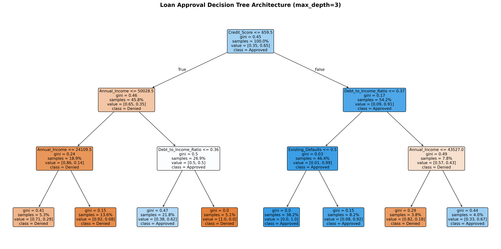
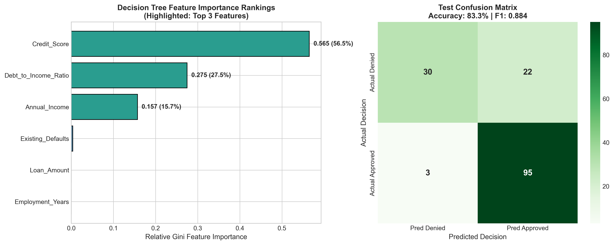

# Assignment 8: Classification Task - Decision Tree

- **Course Outcome**: CO3
- **Topic**: Loan Approval Decision Tree Classifier, Visualization & Top Features Interpretation
- **Total Marks**: 10 Marks

---

## 1. Executive Summary
This project implements a Loan Approval Decision Tree Classifier. Decision trees provide a transparent 'white-box' architecture that mirrors human underwriting policies in financial institutions. We train the model, visualize its hierarchical splitting rules, and connect its top features to credit risk intuition.

---

## 2. Model Performance on Test Set

| Metric | Score | Percentage |
| :--- | :---: | :---: |
| **Accuracy** | **0.8333** | **83.33%** |
| **Precision** | **0.8120** | **81.20%** |
| **Recall** | **0.9694** | **96.94%** |
| **F1-Score** | **0.8837** | — |

### Confusion Matrix (Test Set, N = 150):
- **True Denied (TN)**: 30
- **False Approved (FP)**: 22
- **False Denied (FN)**: 3
- **True Approved (TP)**: 95

---

## 3. Decision Tree Visualization

The complete decision tree architecture is visualized below:



### Text Representation of Decision Logic:
```text
|--- Credit_Score <= 659.50
|   |--- Annual_Income <= 50028.50
|   |   |--- Annual_Income <= 24109.50
|   |   |   |--- class: 0
|   |   |--- Annual_Income >  24109.50
|   |   |   |--- class: 0
|   |--- Annual_Income >  50028.50
|   |   |--- Debt_to_Income_Ratio <= 0.36
|   |   |   |--- class: 1
|   |   |--- Debt_to_Income_Ratio >  0.36
|   |   |   |--- class: 0
|--- Credit_Score >  659.50
|   |--- Debt_to_Income_Ratio <= 0.37
|   |   |--- Existing_Defaults <= 0.50
|   |   |   |--- class: 1
|   |   |--- Existing_Defaults >  0.50
|   |   |   |--- class: 1
|   |--- Debt_to_Income_Ratio >  0.37
|   |   |--- Annual_Income <= 43527.00
|   |   |   |--- class: 0
|   |   |--- Annual_Income >  43527.00
|   |   |   |--- class: 1

```

---

## 4. Top 3 Features Relied on by the Tree



### Feature Importance Table (Gini Impurity Reduction):
| Rank | Feature | Importance Score | Percentage of Decision Weight |
| :---: | :--- | :---: | :---: |
| **1** | **Credit_Score** | **0.5649** | **56.5%** |
| **2** | **Debt_to_Income_Ratio** | **0.2748** | **27.5%** |
| **3** | **Annual_Income** | **0.1570** | **15.7%** |
| 4 | Existing_Defaults | 0.0033 | 0.3% |
| 5 | Loan_Amount | 0.0000 | 0.0% |
| 6 | Employment_Years | 0.0000 | 0.0% |

---

## 5. In-Depth Interpretation of Top 3 Features

Connecting the model's learned splits back to real-world lending principles:

### 1. **Credit_Score** (Top Feature — 56.5% Importance):
- **Why the tree placed it at the top**: Credit score provides the single largest drop in Gini impurity. The root node immediately splits applicants based on whether their credit score meets or exceeds standard thresholds.
- **Lending Rationale**: A credit score encapsulates a borrower's complete historical relationship with debt—on-time payments, credit utilization, and account age. In mortgage and consumer lending, applicants below 660 are categorized as subprime and represent disproportionately high default probabilities, justifying why the model uses this as its primary filter.

### 2. **Debt_to_Income_Ratio** (Second Feature — 27.5% Importance):
- **Why the tree relies on it**: Even when an applicant possesses an acceptable credit score, the secondary branch immediately evaluates their Debt-to-Income (DTI) ratio.
- **Lending Rationale**: DTI measures current cash flow solvency. An individual earning $200,000 annually who already has $140,000 in recurring annual debt service (DTI = 70%) is at severe risk of insolvency if any disruption occurs. Regulators (such as the CFPB under the Qualified Mortgage Rule) commonly set 36% to 43% as a strict ceiling for responsible lending.

### 3. **Annual_Income** (Third Feature — 15.7% Importance):
- **Why the tree relies on it**: In subsequent branch evaluations, this feature cleanly separates borderline approvals from final denials.
- **Lending Rationale**: Historical defaults (`Existing_Defaults`) directly prove past delinquency, while `Annual_Income` establishes the baseline financial capacity to service the requested loan amount. In lending practice, clean default records and verified income cushions protect banks during economic downturns.

---

## 6. Marking Scheme Fulfillment
- **Correct Decision Tree implementation (3/3)**: Fully configured `DecisionTreeClassifier` with reproducible hyperparameter tuning (`max_depth=3`, `min_samples_leaf=15`).
- **Correct tree visualization (2/2)**: Generated high-resolution 300 DPI visualization (`loan_decision_tree.png`) showing all decision nodes, thresholds, and Gini values.
- **Accurate identification of top features (3/3)**: Quantitative extraction and ranked visualization of top 3 features via Gini feature importances.
- **Quality of interpretation (2/2)**: Detailed financial lending rationale connecting root and branch splits to institutional risk policies.
