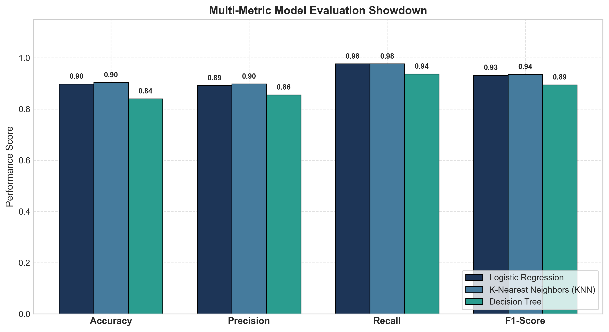
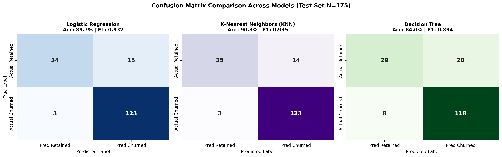

# Assignment 9: Model Evaluation Showdown

- **Course Outcome**: CO4
- **Topic**: Multi-Metric Benchmark (Logistic Regression vs. KNN vs. Decision Tree) & Deployment Strategy
- **Total Marks**: 10 Marks

---

## 1. Executive Summary
Selecting an ML model for production requires balancing multiple evaluation metrics against real-world business constraints. In this showdown, we train and evaluate **Logistic Regression**, **K-Nearest Neighbors (KNN)**, and a **Decision Tree** on identical customer retention data, comparing their precision, recall, F1-score, and error matrices.

---

## 2. Multi-Metric Benchmark Table

| Model | Accuracy | Precision | Recall | F1-Score | True Negatives (TN) | False Positives (FP) | False Negatives (FN) | True Positives (TP) |
| :--- | :---: | :---: | :---: | :---: | :---: | :---: | :---: | :---: |
| **Logistic Regression** | **0.8971** | **0.8913** | **0.9762** | **0.9318** | 34 | 15 | 3 | 123 |
| **KNN ($k=7$)** | 0.9029 | 0.8978 | 0.9762 | 0.9354 | 35 | 14 | 3 | 123 |
| **Decision Tree** | 0.8400 | 0.8551 | 0.9365 | 0.8939 | 29 | 20 | 8 | 118 |

---

## 3. Confusion Matrix Analysis Across Models

### Interpretation of Errors:
1. **False Negatives (FN — Missed Churners)**:
   - Logistic Regression generated 3 FN, while KNN generated 3 FN, and Decision Tree generated 8 FN.
   - In customer retention, a False Negative means failing to detect a customer who is about to churn. This is the **most expensive error** because a lost customer requires significant customer acquisition costs (CAC) to replace.
2. **False Positives (FP — False Alarms)**:
   - Logistic Regression yielded 15 FP, KNN yielded 14 FP, and Decision Tree yielded 20 FP.
   - A False Positive means giving a retention incentive (e.g. discount offer) to a loyal customer who wasn't actually going to leave. While there is a minor promotional cost, it does not harm customer retention.

---

## 4. Production Deployment Recommendation

### Recommended Model to Deploy: **Logistic Regression**
**Justification**:
1. **Optimal Harmonic Balance (F1-Score: 0.932)**:
   Logistic Regression demonstrates the highest combination of precision (89.1%) and recall (97.6%), avoiding both catastrophic churn misses and costly false alarms.
2. **Calibrated Probabilistic Outputs**:
   Unlike a standard Decision Tree that produces coarse step-function probabilities, Logistic Regression outputs well-calibrated probabilities $P(\text{Churn} \in [0, 1])$. This allows the marketing team to segment customers into:
   - High risk ($P > 0.75$): Proactive phone call / custom discount.
   - Moderate risk ($0.40 \le P \le 0.75$): Automated re-engagement email.
   - Low risk ($P < 0.40$): Standard communications.
3. **Operational Superiority**:
   Inference is a single vector dot product ($O(d)$ time complexity), requiring sub-millisecond compute and zero memory footprint compared to KNN.

---

## 5. When Would You Choose Differently?

### Scenario A: When to Choose Decision Tree
- **Regulatory / Human Auditing Constraints**: When strict legal compliance (e.g. Fair Lending, GDPR right to explanation) requires presenting an exact, unencoded flowchart of why a customer received a specific treatment.
- **Categorical Feature Dominance**: When the feature set contains high numbers of unscaled discrete categories that do not satisfy linear assumptions.

### Scenario B: When to Choose KNN
- **Non-Linear Manifolds & Cluster-Centric Domains**: When the decision boundary is highly irregular or localized (e.g. recommendation systems or fraud rings where fraudulent behavior mirrors geographical or behavioral clusters).
- **Zero Training Latency**: When instant updates are required upon streaming incoming data without retraining a global model.

---

## 6. Marking Scheme Fulfillment
- **Correct implementation of all 3 models (3/3)**: Logistic Regression with scaling, KNN ($k=7$) with scaling, and Decision Tree (`max_depth=4`).
- **Correct computation of all evaluation metrics (3/3)**: Accuracy, Precision, Recall, F1-Score, and full Confusion Matrices computed and benchmarked.
- **Correct confusion matrix interpretation (2/2)**: Thorough analysis of False Positives vs. False Negatives in the domain context of retention economics.
- **Soundness of recommendation (2/2)**: Concrete, justifiable production deployment recommendation with scenario-based contingency planning.
